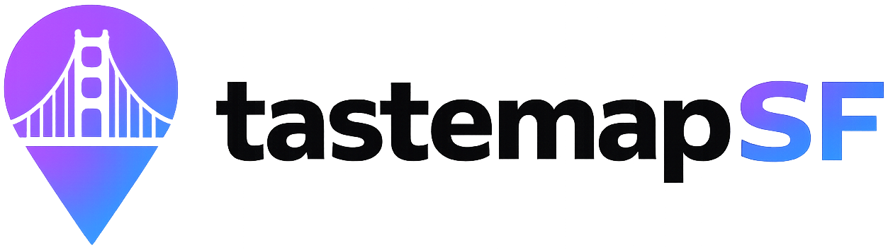

# Tastemap SF

Explore San Francisco's global cuisine, one country at a time.

Tastemap SF is a static React app that turns SF's restaurant diversity into a world map. Click a country to learn what the cuisine is about, what to order first, and where to try it in San Francisco. Mark cuisines you have tried, see your score, share it, or ask the app to pick your next bite.



## Features

- **Interactive world map**: countries with curated cuisine data are highlighted; unseeded countries still open a short suggestion state. Microstates omitted by the 110m TopoJSON render as clickable pins.
- **FIFA WC26 filter**: highlight the restaurant-backed Tastemap countries participating in the 2026 FIFA World Cup, with the United Kingdom counted via England/Scotland.
- **Country side panel**: each seeded country shows cuisine context, signature dishes, and restaurant cards.
- **Tried prompt**: clicking a seeded country opens a Yes/No dialog. Answering or closing the dialog also clears the side panel.
- **Visual progress**: tried countries turn green, receive a consistent green outline, and show the country flag on the map.
- **Checklist mode**: `View list` is grouped by continent, so users can mark countries without browsing the map. Desktop opens it from the hamburger menu; mobile uses a floating `Map` / `List` toggle. Each row expands inline to reveal that country's cuisine summary, signature dishes, and restaurants.
- **Finish flow**: the score dialog opens from the desktop `Finish` CTA, the mobile score pill, or the checklist footer. Its back button returns to the map or list based on where the score dialog was opened.
- **Share flow**: users can share via native share, X, Facebook, or copy. The share message includes the score; the shared link is the plain `tastemapsf.com` URL.
- **Pick My Next Bite**: a lottery-style wheel picks an untried country, reveals it with a larger flag animation, then opens that country's details.
- **Restaurant suggestions**: countries without restaurants include `Send me one`, which opens a prefilled Gmail draft or `mailto:` fallback to `tastemapsf@gmail.com`.
- **About and Get involved**: the hamburger menu separates the project story from open-source/contribution links.
- **Legal & credits**: disclaimer, privacy, and attribution content lives in one hamburger-menu dialog and in `LEGAL.md`.
- **Responsive polish**: desktop keeps the full map/hero layout; mobile uses a compact header, full-height cover-cropped map, floating filter pills, a bottom `Map` / `List` toggle, and iOS-safe modal sheets.
- **Google Maps links**: restaurant cards build search links from restaurant name, neighborhood, and San Francisco.
- **No backend required**: tried progress is stored locally in the browser with `localStorage`.

## Tech Stack

- **React + TypeScript** with Vite
- **react-simple-maps** over D3 / TopoJSON
- **Tailwind CSS v4**
- **Vitest + React Testing Library**
- **CSV-authored data** generated into TypeScript

## Getting Started

### Prerequisites

- Node.js 18+
- npm

### Install And Run

```bash
git clone https://github.com/suman-hazra/tastemapsf.git
cd tastemapsf
npm install
npm run dev
```

The app runs at `http://localhost:5173`.

To test from a phone on the same Wi-Fi network:

```bash
npm run dev -- --host 0.0.0.0
ipconfig getifaddr en0
```

Open `http://YOUR_MAC_IP:5173` on the phone.

### Build And Test

```bash
npm run build
npm test -- --run
```

## Data Workflow

The source of truth is in `data/`:

- `data/countries.csv`: country metadata, cuisine summaries, flags, and signature dishes.
- `data/restaurants.csv`: restaurant rows joined by `country_id`.
- `data/build.mjs`: generates `src/data/restaurants.ts`.
- `src/data/countryIdMap.ts`: map coverage config, including TopoJSON ISO mappings and pin coordinates for microstates omitted by the 110m map.
- `src/data/worldCup2026.ts`: restaurant-backed country slugs used by the `FIFA WC26` map filter.

Do not edit `src/data/restaurants.ts` directly. It is generated.

```bash
npm run build:data
npm run build
```

When adding a country, also make sure its TopoJSON ISO code is mapped in `src/data/countryIdMap.ts`; otherwise the map cannot connect the geography to the app's country slug.

## Current UX

1. Open the map.
2. Use the welcome dialog to start. For checklist mode, open the hamburger menu and choose `View list` on desktop, or tap the floating `List` toggle on mobile. Each row expands inline to show that cuisine's details.
3. Click a highlighted country to open its side panel with cuisine summary, dishes, and restaurants.
4. A centered prompt asks whether you have tried that cuisine.
5. Answering `Yes` turns the country green, adds its flag marker, increments the score, and closes the prompt/panel.
6. Answering `No` or closing the prompt clears the prompt/panel without changing the score.
7. If a country has no restaurants yet, use `Send me one` to draft a restaurant suggestion email.
8. Open the score dialog from desktop `Finish`, the mobile score pill, or the checklist footer to see your score, share it, or use `Pick My Next Bite`.
9. `Pick My Next Bite` spins a wheel, reveals a larger country flag/name, then shifts the map to that country's details.
10. Use the map legend filters to focus on `Soon`, `In SF`, `Tried`, or `FIFA WC26` countries.
11. Use `About`, `Get involved`, and `Legal & credits` from the hamburger menu for project context, contribution links, and policy/attribution notes.

### Mobile UX Notes

- The mobile map intentionally uses a cover-cropped world view so the map fills the available frame.
- Mobile panning bounds are calculated from the visible cropped viewport, so users can pan to regions such as Australia even though the full world is not visible at once.
- The mobile legend appears as floating pills inside the map: `Soon`, `In SF`, `Tried`, and `FIFA WC26`.
- The mobile score pill opens the score dialog; there is no separate mobile `Finish` CTA on the map.
- The mobile `Map` / `List` toggle floats at the bottom of the map and opens the same checklist used by desktop.
- Browser/phone back closes the current list or score overlay before leaving the page. If the score dialog was opened from the list, `Back to list` and browser back both return to the list.
- Desktop-only map labels and controls that do not translate well to the cropped mobile map, such as the `Back to world view` control and the San Francisco text label, are hidden on mobile.
- About, Get involved, and Legal sheets use `dvh`-aware mobile height caps to avoid iOS Safari toolbar clipping.

## Project Notes

- Progress is persisted in `localStorage` on the current device/browser. Cross-device sync still requires a backend and remains future work.
- Shared links use the plain `tastemapsf.com` URL; the score lives in the share message text, not the URL. The app still reads `?score=` / `?total=` query parameters if present, but no longer generates them.
- Legal, privacy, and attribution content is available in the hamburger menu under `Legal & credits` and mirrored in `LEGAL.md`.
- The desktop hamburger menu contains `View list`, `About`, `Get involved`, and `Legal & credits`. Mobile hides `View list` because checklist mode is exposed through the floating `Map` / `List` toggle.
- The About dialog uses `public/suman-about.jpg`, an optimized derivative of `public/suman.jpg`, to reduce mobile image download cost.
- The public contact email for restaurant suggestions and privacy requests is `tastemapsf@gmail.com`.
- Some marker positions use visual overrides where raw geometry centroids look wrong at this scale.
- Andorra remains in the data but its microstate map pin is hidden because it visually interferes with France at the current map scale.
- The `FIFA WC26` filter is a static curated list in `src/data/worldCup2026.ts`; update it as qualification data changes.
- The logo assets were generated with OpenAI tools. The Dolores Park photo attribution still needs exact Wikimedia Commons source confirmation before broader launch.
- The `feedback/` folder is ignored and should stay local.

## Roadmap

- [x] Clickable world map
- [x] Country side panel with restaurants and dishes
- [x] Tried tracking with map flags
- [x] Finish score dialog
- [x] Next-cuisine recommendation
- [x] Share score flow
- [x] Hamburger country checklist grouped by continent
- [x] Restaurant suggestion email flow
- [x] Legal, privacy, and attribution dialog
- [x] Desktop/mobile viewport polish
- [x] FIFA WC26 map filter
- [x] Separate About and Get involved menu/dialog flows
- [x] CSV-driven data workflow
- [x] Local-device persisted progress
- [ ] Cross-device persisted progress
- [ ] More countries and restaurant verification
- [ ] Confirm exact Dolores Park image attribution
- [ ] Broader real-device mobile QA

## Contributing

Found a great restaurant or spotted stale data?

1. Update `data/countries.csv` or `data/restaurants.csv`.
2. Run `npm run build:data`.
3. Run `npm run build`.
4. Open a pull request.

Please keep entries to restaurants that are currently open and genuinely represent the cuisine well.

## License

MIT

See `LICENSE` and `LEGAL.md`.
