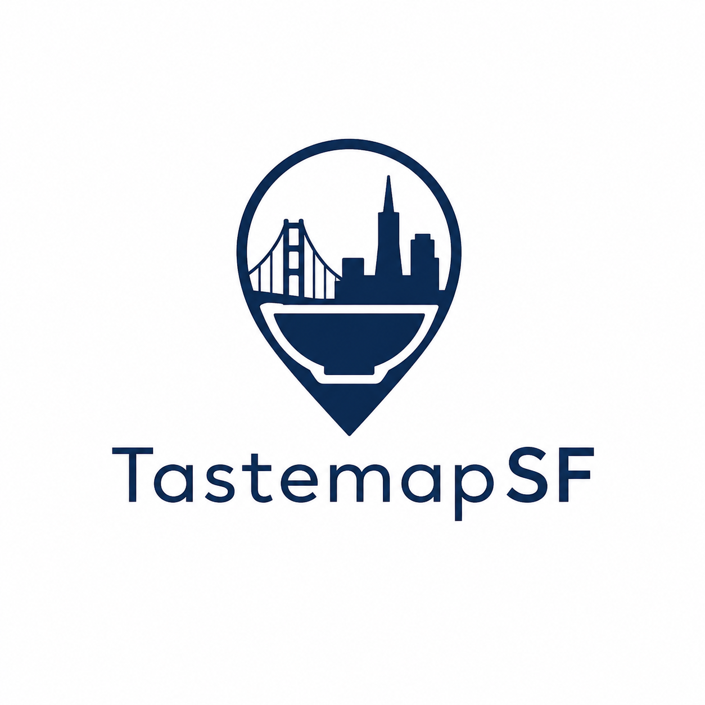

# Tastemap SF

Explore San Francisco's global cuisine, one country at a time.

Tastemap SF is a static React app that turns SF's restaurant diversity into a world map. Click a country to learn what the cuisine is about, what to order first, and where to try it in San Francisco. Mark cuisines you have tried, see your score, share it, or ask the app to pick your next bite.



## Features

- **Interactive world map**: countries with curated cuisine data are highlighted; unseeded countries still open a short suggestion state.
- **Country side panel**: each seeded country shows cuisine context, signature dishes, and restaurant cards.
- **Tried prompt**: clicking a seeded country opens a Yes/No dialog. Answering or closing the dialog also clears the side panel.
- **Visual progress**: tried countries turn green, receive a consistent green outline, and show the country flag on the map.
- **Checklist mode**: the hamburger menu includes `View list`, grouped by continent, so users can mark countries without browsing the map.
- **Finish flow**: the bottom-center `Finish` CTA opens the score dialog.
- **Share flow**: users can share via native share, X, Facebook, or copy. X/copy text includes the score and a score-encoded URL.
- **Pick My Next Bite**: a lottery-style wheel picks an untried country, reveals it with a larger flag animation, then opens that country's details.
- **Restaurant suggestions**: countries without restaurants include `Send me one`, which opens a prefilled Gmail draft or `mailto:` fallback to `tastemapsf@gmail.com`.
- **Legal & credits**: disclaimer, privacy, and attribution content lives in one hamburger-menu dialog and in `LEGAL.md`.
- **Responsive polish**: the main map, dialogs, panels, score UI, and picker are tuned for both desktop and mobile browser viewports.
- **Google Maps links**: restaurant cards build search links from restaurant name, neighborhood, and San Francisco.
- **No backend required**: progress state is in-memory; closing the tab resets progress.

## Tech Stack

- **React + TypeScript** with Vite
- **react-simple-maps** over D3 / TopoJSON
- **Tailwind CSS v4**
- **Vitest + React Testing Library**
- **CSV-authored data** generated into TypeScript

## Getting Started

### Prerequisites

- Node.js 18+
- npm

### Install And Run

```bash
git clone https://github.com/suman-hazra/tastemapsf.git
cd tastemapsf
npm install
npm run dev
```

The app runs at `http://localhost:5173`.

To test from a phone on the same Wi-Fi network:

```bash
npm run dev -- --host 0.0.0.0
ipconfig getifaddr en0
```

Open `http://YOUR_MAC_IP:5173` on the phone.

### Build And Test

```bash
npm run build
npm test -- --run
```

## Data Workflow

The source of truth is in `data/`:

- `data/countries.csv`: country metadata, cuisine summaries, flags, and signature dishes.
- `data/restaurants.csv`: restaurant rows joined by `country_id`.
- `data/build.mjs`: generates `src/data/restaurants.ts`.

Do not edit `src/data/restaurants.ts` directly. It is generated.

```bash
npm run build:data
npm run build
```

When adding a country, also make sure its TopoJSON ISO code is mapped in `src/data/countryIdMap.ts`; otherwise the map cannot connect the geography to the app's country slug.

## Current UX

1. Open the map.
2. Use the welcome dialog to start, or open the hamburger menu and choose `View list` for checklist mode.
3. Click a highlighted country to open its side panel with cuisine summary, dishes, and restaurants.
4. A centered prompt asks whether you have tried that cuisine.
5. Answering `Yes` turns the country green, adds its flag marker, increments the score, and closes the prompt/panel.
6. Answering `No` or closing the prompt clears the prompt/panel without changing the score.
7. If a country has no restaurants yet, use `Send me one` to draft a restaurant suggestion email.
8. Click `Finish` to see your score, share it, or use `Pick My Next Bite`.
9. `Pick My Next Bite` spins a wheel, reveals a larger country flag/name, then shifts the map to that country's details.

## Project Notes

- Progress is intentionally not persisted yet. It resets on refresh or tab close.
- Score links use `?score=` and `?total=` query parameters so shared URLs can display the score context.
- Legal, privacy, and attribution content is available in the hamburger menu under `Legal & credits` and mirrored in `LEGAL.md`.
- The public contact email for restaurant suggestions and privacy requests is `tastemapsf@gmail.com`.
- Some marker positions use visual overrides where raw geometry centroids look wrong at this scale.
- The logo assets were generated with OpenAI tools. The Dolores Park photo attribution still needs exact Wikimedia Commons source confirmation before broader launch.
- The `feedback/` folder is ignored and should stay local.

## Roadmap

- [x] Clickable world map
- [x] Country side panel with restaurants and dishes
- [x] Tried tracking with map flags
- [x] Finish score dialog
- [x] Next-cuisine recommendation
- [x] Share score flow
- [x] Hamburger country checklist grouped by continent
- [x] Restaurant suggestion email flow
- [x] Legal, privacy, and attribution dialog
- [x] Desktop/mobile viewport polish
- [x] CSV-driven data workflow
- [ ] Persisted progress
- [ ] More countries and restaurant verification
- [ ] Confirm exact Dolores Park image attribution
- [ ] Add a personal About section with links
- [ ] Broader real-device mobile QA

## Contributing

Found a great restaurant or spotted stale data?

1. Update `data/countries.csv` or `data/restaurants.csv`.
2. Run `npm run build:data`.
3. Run `npm run build`.
4. Open a pull request.

Please keep entries to restaurants that are currently open and genuinely represent the cuisine well.

## License

MIT

See `LICENSE` and `LEGAL.md`.
